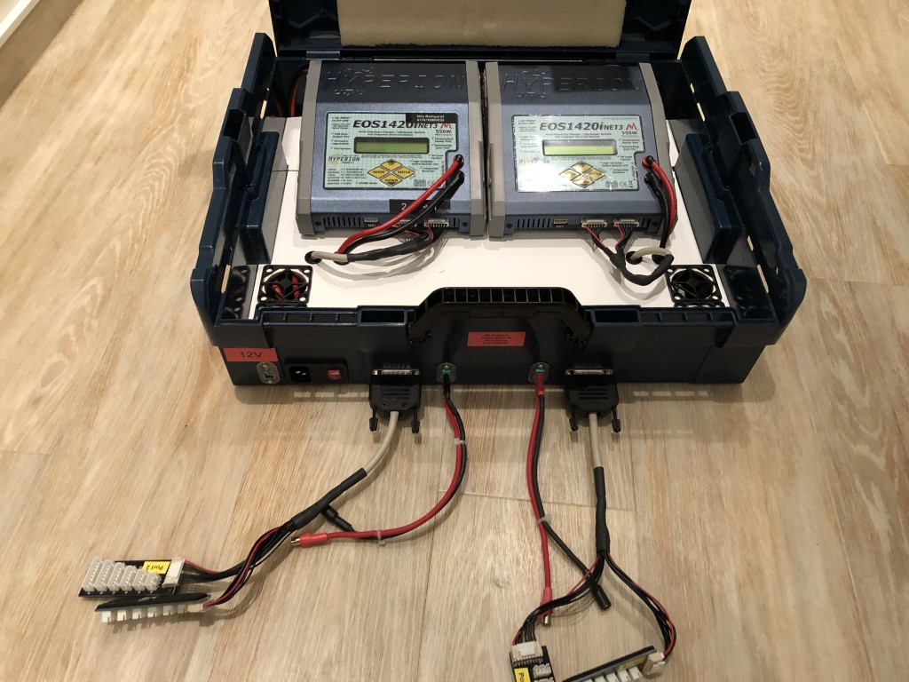
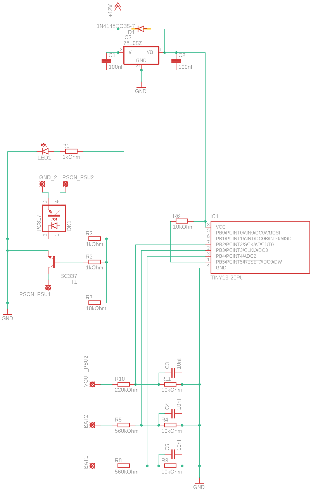

# Chargerbox watchdog for PSUs
I created this chargerbox based on two DPS-1200FB PSU models changed to 25V output. On my airfield with a gas generator there was some overload situations or simply out of gas which leads into an unstable supply voltage. My Hyperion EOS 1420i chargers had an issue if batteries are connected before supply is getting up...the FETs burned regularly. So I decided to build a simple watchdog using the PSU standardpins to avoid this situation.

Based on an small ATTINY13a the IC measures the voltage on the battery connection and detects if a battery is connected on startup. If it detects any it will not switch on the main supply line of the PSUs. Also if the main output fell below 22V it will switch the main supply line off to guard the chargers.

* 12V Supply: PIN 37 12VSB PSU1
* PSON_PSU1: PIN 33 PSON# PSU1
* PSON_PSU2: PIN 33 PSON# PSU2
* VOUT_PSU2: PIN 1-13, 52-64 12V PSU2 (main supply line of 25V)
* GND: PIN 30 GND PSU1
* GND_2: PIN 30 GND PSU2
* BAT1: Battery 1 up to 65V
* BAT2: Battery 2 up to 65V